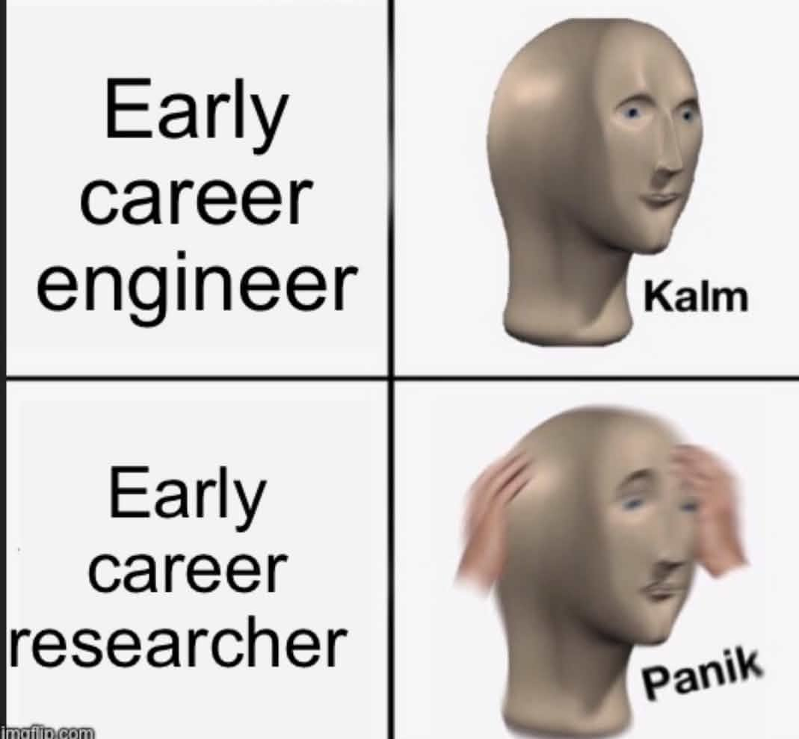
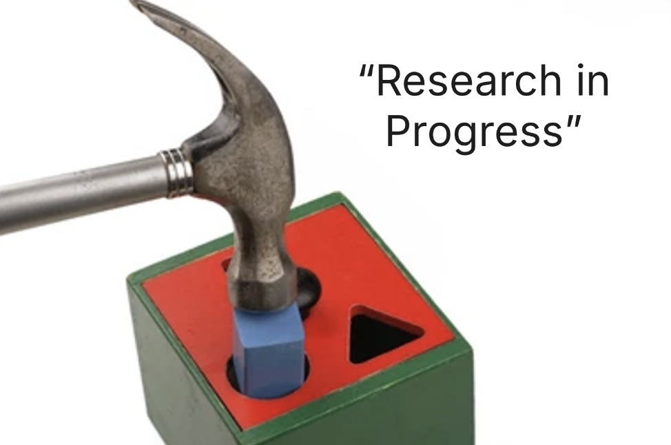
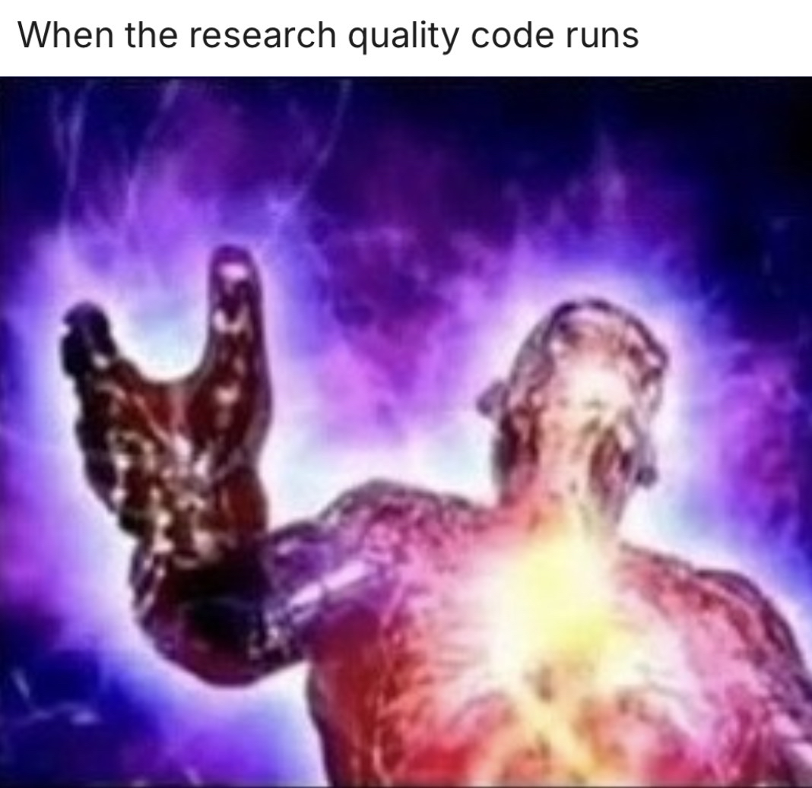
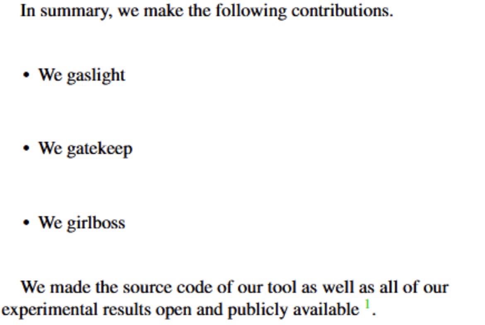
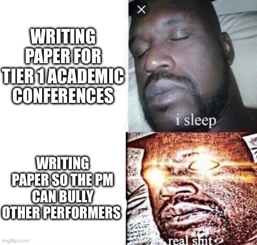

# Onboarding from Kwiss

Greetings,

So you decided to do research. The following documents will help you get up to speed on the process. I assume that you are probably tired of just reading research papers. The goal of this process is to develop research judgement on what is a defensible scoped project worth pursuing, what is engineering integration hell, and what is "novelty".


Engineering is solving known problems with known solutions. Research is solving unknown problems with unknown solutions. Unsurprisingly, sponsors are willing pay a lot for research, but research proposals are a later issue.


A lot of research is trying to use old tools/concepts in a new context. It's normal for a lot of research projects to be built on older projects that are archived or poorly documented, held together by only hopes and dreams. Our goal is only to create a rapid prototype not a production system. The joke "research quality code" is about making something that barely works, just enough to create figures that we can yap about in papers.

## Contents
```
.
└── Onboarding from Kwiss/
    ├── Memes/
    │   ├── meme1.jpg
    │   ├── meme2.png
    │   └── meme3.png
    ├── README.md
    ├── Wednesday Report Template.md
    ├── W3CIL Handbook.pdf
    ├── HowToReadAPaper: TLDR Triage Attention.pdf
    ├── Carter's Example Tool Paper.pdf
    ├── My Example Measurement Paper.pdf
    ├── My Cringe Example SoK Paper.pdf
    └── Did you know the orginal angr paper was an SoK?.pdf
```
## README
This document dummy

## Wednesday Report Template
It doesn't need to be Wedneday. However, get used to either journaling or keeping a TODO list. Carter used to keep a "Captain's Log" during his PhD. Others like Jira-Styled Kanban Boards. I personally like creating lots of README files.

## W3CIL Handbook
The lab handbook with institutional knowledge collected over time. 

Notable contents:
- How to write a research paper (tool)
- How to write a paper review
- How to start a new project

### How to write a research paper
For your sanity, write the sections out of order. I usually do design, evaluation/figures, overview, related, discussion, intro, conclusion, abstract. The intro is the "mini research paper".

### How to write a paper review
- Short summary to prove you read the thing
- Specific comments (ex: Clarify what this means in Figure 1, This is overclaiming here)

### How to start a new project
Be able to answer the following questions:
- What is the problem you are trying to solve?
- Why is this problem important?
- How do you plan to solve it?
- How does your solution differ from related work?
- How will you evaluate your solution?

## How to Read a Research Paper
Good artists steal. Reuse evaluation methodology and code when possible. They went through the struggle of publishing a paper, so we want to piggy back off their unspoken lessons learned. Reading without a concrete question is easy to confuse with progress. Read with a purpose, then go build something. Tinkering >> Reading. 

## Research Paper Taxonomy
- Tool Paper
    * My solution go brr X percent better than the baseline for these metrics. "Magical AI tool".
    * See Carter's paper "ARCUS"
- Measurement Paper
    * My experiment/baseline/benchmark finds an interesting problem. "Rigorous Principled Evidence TM"
    * See my paper "How Many Capabilities Is Too Many?"
- Systemization of Knowledge
    * My glorified literature review with a mythical X factor that makes reviewers happy. "Extended discussion and future work"
    * My "Beginner-Friendly Introduction to Fault Injection Attacks" got review bombed
    * See the angr paper for an example of an SoK that took generations to make



## IMPORTANT
At some point, you need to graduate from someone else giving you tasks and learn to navigate ambiguity on your own. Managing ambiguity professionally is what higher positions in the technical corpo ladder do.



## MISC

A few other observations:
- Papers are a means, not an end.
    * Papers are one way to communicate research, build a reputation, and ultimately graduate. The real goal is developing the ability to identify and solve important problems.
- Conference reviews are often frustrating.
    * Learn from reviews, but don't treat them as absolute truth. Even excellent papers receive contradictory, incorrect, or superficial reviews. Rejection is part of the process.

- Academia is only one part of the research ecosystem.
    * Universities, national labs, startups, and industry research groups all do research, but they optimize for different outcomes. Learn what incentives drive each environment.




**Maybe the real research was the friends along the way**
